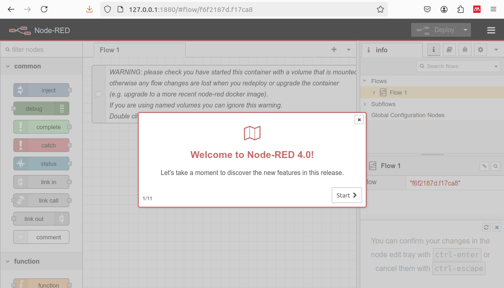
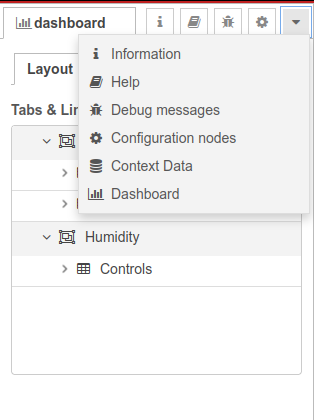
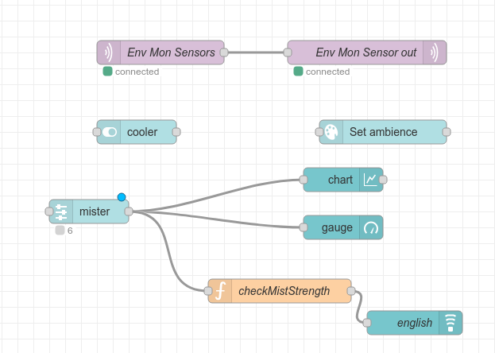
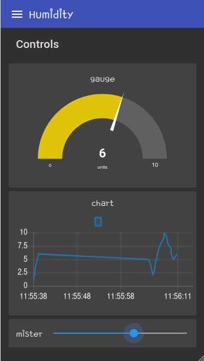
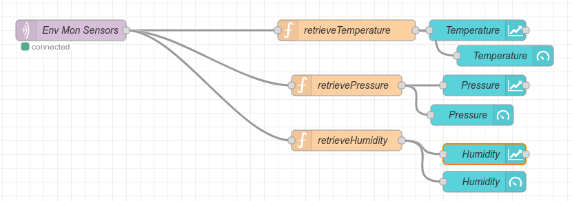
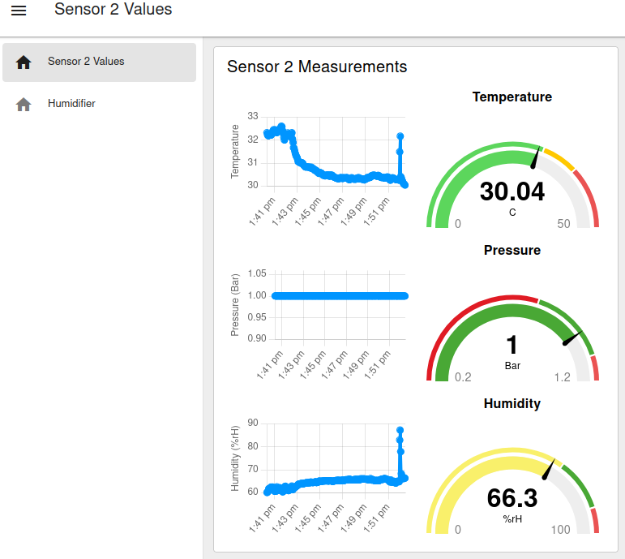
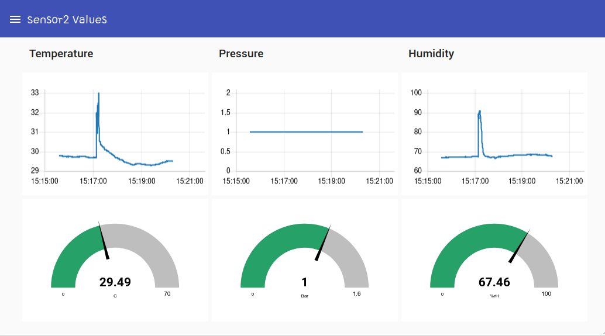
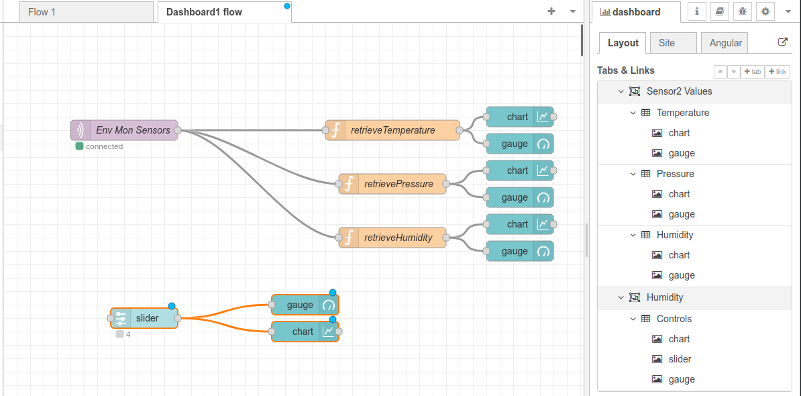

# Mosquitto ESP Node-red environment monitor

Ubuntu MQTT project for IoT

## test server

!!! info "Subscribe"
	mosquitto_sub -v -t 'test/topic'

!!! info "Publish"
	mosquitto_pub -t 'test/topic' -m 'helloWorld'


The above will cause the subscribe command to output `helloWorld`. tested over localhost.

## Installing node red (111 MB)

+ `sudo docker run -it -p 1880:1880 -v /home/pi/.node-red:/data --name mynodered nodered/node-red`

??? "Data directory permissions"
	Users migrating from version 0.20 to 1.0 will need to ensure that any existing /data directory has the correct
	ownership. As of 1.0 this needs to be 1000:1000. This can be forced by the command 
	sudo chown -R 1000:1000 path/to/your/node-red/data

```

## RUn commands inside this docker container

`docker exec -it mynodered /bin/bash`


---------------------------------------------------------------------

5 Nov 04:48:24 - [info] Server now running at http://127.0.0.1:1880/
5 Nov 04:48:24 - [warn] Encrypted credentials not found
5 Nov 04:48:24 - [info] Starting flows
5 Nov 04:48:24 - [info] Started flows
```

+ The docker installation also launches node-red, but you can `ctrl-c` and restart it with `node-red`

+ Navigate to http://127.0.0.1:1880/




## Access authentication

password hashes are stored. you can create the hash using the command `node-red admin hash-pw` . node-red exists inside docker, so first use `docker exec -it mynodered /bin/bash`


open ~/.node-red/settings.js

!!! warning "admin password"
	```

	/** To password protect the Node-RED editor and admin API, the following
	* property can be used. See https://nodered.org/docs/security.html for details.
	*/
	adminAuth: {
	type: "credentials",
	users: [{
	    username: "adminusername",
	    password: "$2y$08BC34*ATUO5Fadminpasswordhash6zybFRVCA1jAAAAUcy",
	    permissions: "*"
	}]
	},
	```

!!! info "ui access password"
	```
	httpNodeAuth: {user:"username",pass:"$2y$08$mQF0kmw----thisisabcrypthash----sis2mXmElZyHdaw0XuOXTuT9bcDVju"},
	```

## node-red-dashboard

Manage Pallette( Alt-p)


+ node-red-dashboard 3.6.5


### Create the layout : node red dashboard

From the right side menu, select `Dashboard` , and click on the Layouts tab. Here you can add tabs, and groups under each tab. Groups are essential, and each ui widget must be assigned a group inside which it will be shown.

+ Layout



+ Sample workflow




+ My dashboard with Humidity controller




## Trouble with accessing MQTT via different IP

set the listener to use `0.0.0.0`

??? tip "/etc/mosquitto/mosquitto.conf"

	```
	# Place your local configuration in /etc/mosquitto/conf.d/
	#
	# A full description of the configuration file is at
	# /usr/share/doc/mosquitto/examples/mosquitto.conf.example

	persistence true
	persistence_location /var/lib/mosquitto/

	log_dest file /var/log/mosquitto/mosquitto.log

	include_dir /etc/mosquitto/conf.d

	allow_anonymous true
	listener 1883 0.0.0.0
	```


## Migrating to dashboard-2 by Flowfuse

I needed a grid in landscape mode, and not just portrait. Miss the angular style widgets, but will
make do.






## Returning to dashboard 1

I stand corrected. The original dashboard is also responsive, and with the use of multiple groups, looks
quite nice. There is also a layout edit option when you hover the mouse over any tab in the Tabs and Links section.





The flowfuse graph wasn't as pretty, which is why I tried reverting. Anyway, I have 2 flow pages, and both dashboards are currently active.


## embed map

Tried a library to embed maps, but it doesn't offer widgets, and instead makes a new page under /worldmap. 

 
## Mosquitto log

??? "View the mosquitto log file | connect/disconnect events"
	sudo tail -f /var/log/mosquitto/mosquitto.log 
	```
	1730874020: Client BME_ROOM2 already connected, closing old connection.
	1730874020: New client connected from 192.168.23.249:55356 as BME_ROOM2 (p2, c1, k30).
	1730874023: New connection from 192.168.23.124:60488 on port 1883.
	1730874023: Client BME_ROOM1 already connected, closing old connection.
	1730874023: New client connected from 192.168.23.124:60488 as BME_ROOM1 (p2, c1, k30).
	```
	helped troubleshoot an instance where i had 2 sensors with the same client name. So when one sends data,
	the other gets disconnected. Like this:

	```
	1730872526: Client BME_ROOM already connected, closing old connection.
	1730872526: New client connected from 192.168.23.124:50519 as BME_ROOM (p2, c1, k30).
	1730872542: New connection from 192.168.23.249:49503 on port 1883.
	1730872542: Client BME_ROOM already connected, closing old connection.
	1730872542: New client connected from 192.168.23.249:49503 as BME_ROOM (p2, c1, k30).
	1730872557: New connection from 192.168.23.124:50520 on port 1883.
	1730872557: Client BME_ROOM already connected, closing old connection.
	1730872557: New client connected from 192.168.23.124:50520 as BME_ROOM (p2, c1, k30).
	1730872572: New connection from 192.168.23.249:49504 on port 1883.
	1730872572: Client BME_ROOM already connected, closing old connection.
	1730872572: New client connected from 192.168.23.249:49504 as BME_ROOM (p2, c1, k30).
	1730872587: New connection from 192.168.23.124:50521 on port 1883.
	1730872587: Client BME_ROOM already connected, closing old connection.
	1730872587: New client connected from 192.168.23.124:50521 as BME_ROOM (p2, c1, k30).
	1730872602: New connection from 192.168.23.249:49505 on port 1883.
	```
 
 
## Enabling clients via Javascript
 
 I wanted to use this with embedded webviews running on android, but those do not support mqtt, but need
 to use the websockets protocol. mosquitto 1.6 needed to be upgraded to 2.0 
 
```
sudo apt-add-repository ppa:mosquitto-dev/mosquitto-ppa  
sudo apt update
sudo apt install mosquitto
```

The new mosquitto.conf file which adds port 9001 for websocket connections

```
persistence true
persistence_location /var/lib/mosquitto/

log_dest file /var/log/mosquitto/mosquitto.log

include_dir /etc/mosquitto/conf.d

allow_anonymous true
listener 1883 0.0.0.0

listener 9001 0.0.0.0
protocol websockets
socket_domain ipv4

```


